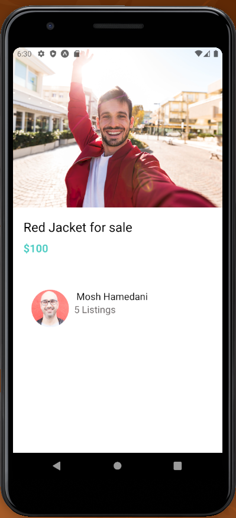

# ListingDetailsScreen

## Structure

- View that will serve as container.
- An Image
- text for title and subtitle
- A view that is a container for everything for everything but the image.
- We use our `AppText` reusable for title and subtitle, and override the default styles for each one when necesary.
- Create a view to separate the user that is posting from the image and its title.
- We call `ListElement` reusable.

## Style

- The userContainer style with marginVertical is useful for separating the image and text with the user.
- We give the image width **"100%"** allowing it to grow along the X axis.

- detailsContainer padding is useful so the text is not so close to the screen.

# MessagesScreen

## Structure

- Place everything inside Screen reusable, so its not so close to the top edge of the screen.
- We use flatlist and pass in our **ListItem** custom component. We send in our reusable custom component of **ListItemDeleteAction** along with its props
- We wrap everything up sinde `SafeAreaView`, so in Ios, doesnt interfer with the upper part.

## Functionality

- For now, we create objects that will be later substitued by api

We use `ItemSeparatorComponent` in **FlatList** to separate each element.
We send in our custom separator.

> Notice that when we pass in the component to **ListItemSeparator** prop in FlatList, **we dont use <>** But ListItemDeleteAction does, because we need to send in props

- We create a function for deleting that will be passed in to the `ListItemDeleteAction`.
  - It will delete the message from the message array.
  - We call the server so we delete

Well create a `useState` hook.

### Pull to Refresh

Well need a boolea state hook to decide if refreshing or not.
Inside FlatList component we use

- **refreshing**: set to teh value of hook
- **OnRefresh**: This will the backend to retrieve the list later. For now, well simulate putting a new array.

# ViewImageScreen

## Structure

1. We create a view that will be a container
2. Place inside two views that will later be buttons
3. We place an image and set resizeMode to contain so it doesn takes the whole scren.
4. We add icons inside of views created in step 2

## Style

For container:

- flex:1 so container uses whole screen

For close and deleteIcon:

- We give a fixed width and height
- **absolute position** so we can move them aroun withou affecting global layout

For image:

- We allow it to grow giving it "100%"

# Welcome Screen

## Structure

We use ImageBackground component so it fits the whole screen. This will be the container for all of our child components.

1. At the top, create ImageBackground component
2. We create two containers, one for logo and its text and another for appButtons.
3. We use image component, these will get resized in style

## Style

For background:

- We set flex 1 so it fills the whole screen,
- Center it with justifyContent and alignItems

For buttonsContainer:

- We set padding so they are separated one from another
- We set with to "100%" so our buttons dont get shrunk.

For logo:

- We set a fixed size to resize the big image logo.

For logoContainer: This will place text and logo at top center.

- **Position absolute**, so it doesnt goes to bottom.

For tagline: These are the styles for text below the image.

- Font size: to increase font
- FontWeight: To make font thicker
- PaddingVertical, so its no so close to the logo image.

## Functionality

## Styling

- Create a view and put AppButton in it, apply padding to that view,
- We also apply width: '100%' so it doesnt shinks our button
