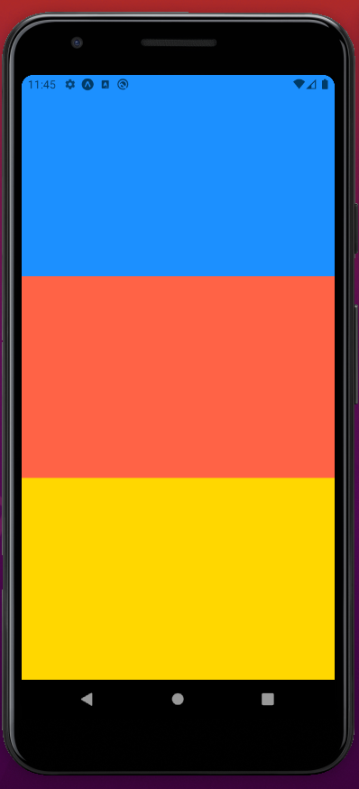

# Stylesheet API

It's the recommended way to work our styles

We use `stylesheet.create` for 2 reasons:

- validate each property used here, so we dont mispell a property
- optimizations

```javascript
const styles = StyleSheet.create({
  container: {
    flex: 1,
    backgroundColor: "#fff",
    alignItems: "center",
    justifyContent: "center",
  },
});
```

# Layout

## Density independent pixels

> Physical pixels = DIPS x Scale Factor

```javascript
 style={{
          backgroundColor: "dodgerblue",
          width: 150,
          height: 70,
        }}
```

### Using percentage

If we want to use exact percentage of device can use:

> Note its between quotes!

```javascript
<View
  style={{
    backgroundColor: "dodgerblue",
    width: "50%",
    height: 70,
  }}
></View>
```

### Dimensions API (Doesnt works with landscape view)

Useful for getting the dimensions of the mobile

We use the method Dimensions.get(), and we can send either of two strings:

- window: Size of visible application window
- Screen: Size of the entire screen
  > In ios they are the same, in android they are not.

```javascript
console.log(Dimensions.get("screen"));
```

This will output

```javascript
Object {
  "fontScale": 1,
  "height": 807.2727272727273,
  "scale": 2.75,
  "width": 392.72727272727275,
}
```

### Detecting orientation changes using hooks(Preferred way)

This will alow us to resize or components acordingly

#### Setting up hooks

In app.json, change to:

```javascript
 "orientation": "portrait"
```

Type

```shell script
npm i @react-native-community/hooks
```

### Getting device dimensions

#### Import

```javascript
import { useDimensions } from "@react-native-community/hooks";
```

Output:

```javascript
 "window": Object {
    "fontScale": 1,
    "height": 759.2727272727273,
    "scale": 2.75,
    "width": 392.72727272727275,
  },
```

#### Usage

```javascript
console.log(useDimensions());
```

### Checking if device is currently in portrait or landscape

#### Import

```javascript
import { useDeviceOrientation } from "@react-native-community/hooks";
```

#### Usage

```javascript
Object {
  "landscape": true,
  "portrait": false,
}

```

### Example of usage

```javascript
import { useDimensions } from "@react-native-community/hooks";
import { useDeviceOrientation } from "@react-native-community/hooks";

export default function App() {
  const { landscape } = useDeviceOrientation();

  return (
    <SafeAreaView style={[styles.container, styles.background]}>
      <View
        style={{
          backgroundColor: "dodgerblue",
          width: "100%",
          height: landscape ? "100%" : "30%",
        }}
      ></View>
    </SafeAreaView>
  );
}
```

# Individual elements

## Flex

```javascript
flex: 1;
```

The view is flexible and will extend vertically and horizontally to fill the space.

### example: Placing child views inside another

If we set the value of each children equal to 1, the space will get divided
equally

```javascript
import React from "react";
import { View } from "react-native";

export default function App() {
  return (
    <View
      style={{
        flex: 1,
        backgroundColor: "#fff",
      }}
    >
      <View
        style={{
          flex: 1,
          backgroundColor: "dodgerblue",
        }}
      />
      <View
        style={{
          flex: 1,
          backgroundColor: "tomato",
        }}
      />
      <View
        style={{
          flex: 1,
          backgroundColor: "gold",
        }}
      />
    </View>
  );
}
```

Result:

