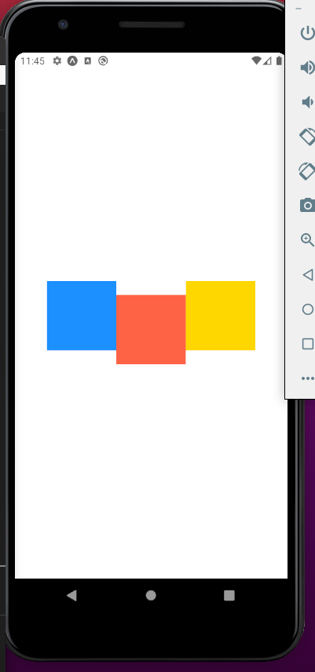

# Stylesheet API

It's the recommended way to work our styles

We use `stylesheet.create` for 2 reasons:

- validate each property used here, so we dont mispell a property
- optimizations

```javascript
const styles = StyleSheet.create({
  container: {
    flex: 1,
    backgroundColor: "#fff",
    alignItems: "center",
    justifyContent: "center",
  },
});
```

# Layout

## Density independent pixels

> Physical pixels = DIPS x Scale Factor

```javascript
 style={{
          backgroundColor: "dodgerblue",
          width: 150,
          height: 70,
        }}
```

### Using percentage

If we want to use exact percentage of device can use:

> Note its between quotes!

```javascript
<View
  style={{
    backgroundColor: "dodgerblue",
    width: "50%",
    height: 70,
  }}
></View>
```

### Dimensions API (Doesnt works with landscape view)

Useful for getting the dimensions of the mobile

We use the method Dimensions.get(), and we can send either of two strings:

- window: Size of visible application window
- Screen: Size of the entire screen
  > In ios they are the same, in android they are not.

```javascript
console.log(Dimensions.get("screen"));
```

This will output

```javascript
Object {
  "fontScale": 1,
  "height": 807.2727272727273,
  "scale": 2.75,
  "width": 392.72727272727275,
}
```

### Detecting orientation changes using hooks(Preferred way)

This will alow us to resize or components acordingly

#### Setting up hooks

In app.json, change to:

```javascript
 "orientation": "portrait"
```

Type

```shell script
npm i @react-native-community/hooks
```

### Getting device dimensions

#### Import

```javascript
import { useDimensions } from "@react-native-community/hooks";
```

Output:

```javascript
 "window": Object {
    "fontScale": 1,
    "height": 759.2727272727273,
    "scale": 2.75,
    "width": 392.72727272727275,
  },
```

#### Usage

```javascript
console.log(useDimensions());
```

### Checking if device is currently in portrait or landscape

#### Import

```javascript
import { useDeviceOrientation } from "@react-native-community/hooks";
```

#### Usage

```javascript
Object {
  "landscape": true,
  "portrait": false,
}

```

### Example of usage

```javascript
import { useDimensions } from "@react-native-community/hooks";
import { useDeviceOrientation } from "@react-native-community/hooks";

export default function App() {
  const { landscape } = useDeviceOrientation();

  return (
    <SafeAreaView style={[styles.container, styles.background]}>
      <View
        style={{
          backgroundColor: "dodgerblue",
          width: "100%",
          height: landscape ? "100%" : "30%",
        }}
      ></View>
    </SafeAreaView>
  );
}
```

# Flexbox

```javascript
flex: 1;
```

If we set `flex:1` The view is flexible and will extend vertically and horizontally to fill the space.

### example: Dividing space equally

If we set the value of each children equal to 1, the space will get divided
equally

```javascript
import React from "react";
import { View } from "react-native";

export default function App() {
  return (
    <View
      style={{
        flex: 1,
        backgroundColor: "#fff",
      }}
    >
      <View
        style={{
          flex: 1,
          backgroundColor: "dodgerblue",
        }}
      />
      <View
        style={{
          flex: 1,
          backgroundColor: "tomato",
        }}
      />
      <View
        style={{
          flex: 1,
          backgroundColor: "gold",
        }}
      />
    </View>
  );
}
```


### Example: Giving more space to a section

If we set flex to be greater that its siblings, it will take more space

```javascript
import React from "react";
import { View, StyleSheet } from "react-native";

export default function App() {
  return (
    <View
      style={{
        backgroundColor: "dodgerblue",
        flex: 1,
      }}
    >
      <View
        style={{
          backgroundColor: "dodgerblue",
          flex: 1,
        }}
      />
      <View
        style={{
          backgroundColor: "gold",
          flex: 3,
        }}
      />
      <View
        style={{
          backgroundColor: "tomato",
          flex: 1,
        }}
      />
    </View>
  );
}
```


### Example: Giving elements a fixed size

```javascript
import React from "react";
import { View, StyleSheet } from "react-native";

export default function App() {
  return (
    <View
      style={{
        backgroundColor: "#fff",
        flex: 1,
      }}
    >
      <View
        style={{
          backgroundColor: "dodgerblue",
          width: 100,
          height: 100,
        }}
      />
      <View
        style={{
          backgroundColor: "gold",
          width: 100,
          height: 100,
        }}
      />
      <View
        style={{
          backgroundColor: "tomato",
          width: 100,
          height: 100,
        }}
      />
    </View>
  );
}
```


## FlexDirection

> By default the views get layed up vertically, but we can change the default behaviour
> depending on what we need:

- row: Lay thins horizontally, main axis is the horizontal
- row-reverse
- column: default value, main axis is vertical
- column-reverse

> Doing so, we define our main axis!

### Usage tips

- Set it just for container!
- If you want to move individual elements, wrap them inside a div that serves as a container

### justifyContent

Align elements along the **main axis**

- center
- fle-end: end of the axis
- flex-start: the default value
- space around: Space between each item is equal, except for the first and last element.
- space-evenly: same across all elements
- space-between: First and last elements are pushed to the **edges** of the screen.

> For container

#### Example

## alignItems

Align items accross the secondary axis.

- center
- flex-end: Items will appear at the end of the secondary axis
- flex-start: start of the secondary axis
- stretch: The elemen will stretch to fill the entire secondary axis. Works if we dont set fixed dimensions like height:100, width:100. **Its the default value**
- baseline: Put the same baseline on each item

#### BaseLine Example


> For container

# Aligning individual

## alignSelf

It will apply to the individual element, and ignoring the container definition

```javascript
import React from "react";
import { View, StyleSheet, ImageBackground } from "react-native";
const Blocks = () => {
  return (
    <View
      style={{
        backgroundColor: "#fff",
        flex: 1,
        flexDirection: "row",
        justifyContent: "center",
        alignItems: "center",
      }}
    >
      <View
        style={{
          backgroundColor: "dodgerblue",
          width: 100,
          height: 300,
          alignSelf: "flex-start",
        }}
      />
      <View
        style={{
          backgroundColor: "gold",
          width: 100,
          height: 200,
        }}
      />
      <View
        style={{
          backgroundColor: "tomato",
          width: 100,
          height: 100,
        }}
      />
    </View>
  );
};

export default Blocks;
```


## flexWrap

Default behaviour: If our items overflow accross the main axis, one or more items allong it get shrunk so other items can fit the screen
.

- nowrap: default mode
- wrap

## Align all content as whole: alignContent

When we enable wrapping, alignItems property behaves a little different.
If we have multiple lines, aligItems property determines the alignment of items within each line.

Takes same string arguments as justifyContent

Align the entire content as whole

> It only works if we have wrapping, otherwise, it doesnt has an effect

## flexBasis

Set size of an item along the primary axis. It can map widht or height, depending of
flexDirection

## flexGrow

Sames a flex

## flexShrink

Opposite of grow.

> Its like saying: If you have overflowing, this item can get shrunk so other items can fit in

## flex is a shorhand for flexGrow and flexShrink

if we set flex to -1, negative number, its exactly the same to setting flexShrink

## Absolute and Relative Positioning

**Useful for moving an element without chaning the layout around it.**
With these properties we can position a component relative to its current position
without affecting the layout around it

### Top and Bottom

#### Example: Moving element 20 positions

Moving 20 positiosn from top.

Applying to tomato:

```javascript
top: 20;
```

or

```javascript
bottom: -20;
```



```javascript
top: -20;
```

Or

```javascript
bottom: 20;
```


### Left and Right

Same behaviour as top and bottom.

### Position

**Affects layout around element**
By default each view uses relative. But if we change it **absolute** the element
will place relative to its parent(container) and the other views will move around as a result.

### Example:

- Move 20 px to left and top from parent container
- Others view moved around

```javascript
import React from "react";
import { View } from "react-native";

export default function App() {
  return (
    <View
      style={{
        flex: 1,
        backgroundColor: "#fff",
        flexDirection: "row",
        justifyContent: "center",
        alignItems: "center",
      }}
    >
      <View
        style={{
          flexBasis: 100,
          width: 100,
          height: 100,
          backgroundColor: "dodgerblue",
        }}
      />
      <View
        style={{
          width: 100,
          height: 100,
          backgroundColor: "tomato",
          left: 20,
          top: 20,
          position: "absolute",
          //alignSelf: "flex-start",
        }}
      />
      <View
        style={{
          width: 100,
          height: 100,
          backgroundColor: "gold",
        }}
      />
    </View>
  );
}
```


> If you use relative positioning, other views wont move, if we use absolute, other views will be repositioned.

## Borders

```javascript
import React from "react";

import Blocks from "./components/Blocks";
import WelcomeScreen from "./app/screens/WelcomeScreen";
import ViewImageScreen from "./app/screens/ViewImageScreen";
import { View } from "react-native";
export default function App() {
  return (
    <View
      style={{
        flex: 1,
        justifyContent: "center",
        alignItems: "center",
      }}
    >
      <View
        style={{
          backgroundColor: "dodgerblue",
          width: 100,
          height: 100,
          borderWidth: 10,
          borderColor: "royalblue",
          borderRadius: 50,
        }}
      ></View>
    </View>
  );
}
```


## Paddings and Margins

Padding vs Margin Difference


Padding not working in Android?

```javascript
import React from "react";

import Blocks from "./components/Blocks";
import WelcomeScreen from "./app/screens/WelcomeScreen";
import ViewImageScreen from "./app/screens/ViewImageScreen";
import { View } from "react-native";
export default function App() {
  return (
    <View
      style={{
        flex: 1,
        justifyContent: "center",
        alignItems: "center",
      }}
    >
      <View
        style={{
          backgroundColor: "dodgerblue",
          width: 100,
          height: 100,
          elevation: 20,
        }}
      >
        <View
          style={{
            backgroundColor: "gold",
            width: 50,
            height: 50,
            padding: 20,
            paddingHorizontal: 10,
            paddingLeft: 30,
          }}
        />
      </View>
      <View
        style={{
          backgroundColor: "tomato",
          width: 100,
          height: 100,
          margin: 20,
        }}
      />
    </View>
  );
}
```


## Styling Text
